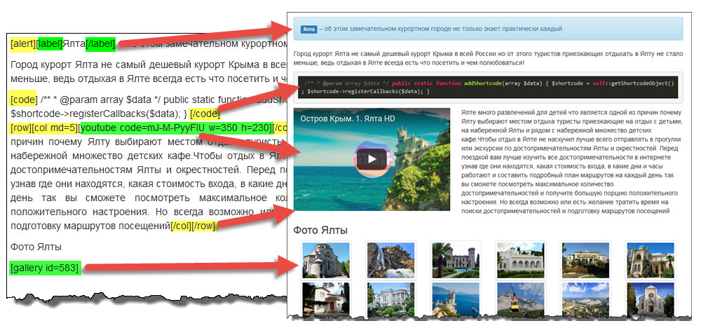

# Yii2-shortcodes-pack
[](https://packagist.org/packages/loveorigami/yii2-shortcodes-pack) 
[](https://packagist.org/packages/loveorigami/yii2-shortcodes-pack)
[](https://packagist.org/packages/loveorigami/yii2-shortcodes-pack)

Yii2-shortcodes-pack is part of the [Yii2-plugins-system](https://github.com/loveorigami/yii2-plugins-system) that have more usefull shortcodes for our site



## 0. Shortcodes in pack
Shortcode     | Description | Usage                                                           | Code 
------------- | ------------|---------------------------------------------------------------- | -------- 
yt	          | YouTube link on original video | [yt code="*"] Link on video [/yt]            | [see](src/web/youtube)
youtube	      | Embed YouTube video with parameters | [youtube code="*" w="*" h="*"]          | [see](src/web/youtube)
code	      | All the blocks of text enclosed in the shortcode [code], will be highlighted  | [code style="*" lang="*"] ... [/code] |	[see](src/content/codehighlight)
container     |	Bootstrap 3 grid - container (default or fluid)| [container] ... [/container] | [see](src/bootstrap#grid)
row	          | Bootstrap 3 grid - row| [row] ... [/row]	                                  | [see](src/bootstrap#grid)
col	          | Bootstrap 3 grid - column (lg, md, sm, xs) | [col md=6] ... [/col]            | [see](src/bootstrap#grid)
alert	      | Bootstrap 3 alert messages | [alert close=1] ... [/alert]                     | [see](src/bootstrap#alerts)
label	      | Bootstrap 3 labels | [label text="*"]	                                      | [see](src/bootstrap#label)
tabs	      | Bootstrap 3 tabs or pills | [tabs] [tab] ... [/tab] [/tabs]                   | [see](src/bootstrap#tabs)

and more in future releases...

### How create my shortcode?

* It is very easy! [See instruction](docs/create_shortcode.md)

* * *

## 1. Download

Yii2-shortcodes-pack be installed using composer. Run following command to download and
install Yii2-shortcodes-pack:

```bash
composer require "loveorigami/yii2-shortcodes-pack": "*"
```

## 2. Update database schema

The last thing you need to do is updating your database schema by applying the migrations. Make sure that you have properly configured db application component and run the following command:
```
$ php yii migrate/up --migrationPath=@vendor/loveorigami/yii2-plugins-system/migrations
```

## 3. Configure application

Let's start with defining module in `@backend/config/main.php`:

```php
'modules' => [
    'plugins' => [
        'class' => 'lo\plugins\Module',
        'pluginsDir'=>[
            '@lo/plugins/core', // default dir with core plugins
			'@lo/shortcodes' // dir with shortcodes pack
            '@common/shortcodes', // dir with our plugins with shortcodes
        ]
    ],
],
```
That's all, now you have module installed and configured in advanced template.

Next, open `@frontend/config/main.php` and add following:

```php
...
'components' => [
    'plugins' => [
        'class' => lo\plugins\components\PluginsManager::class,
        'appId' => 1 // lo\plugins\BasePlugin::APP_FRONTEND,
        // by default
        'enablePlugins' => true,
        'shortcodesParse' => true,
        'shortcodesIgnoreBlocks' => [
            '<pre[^>]*>' => '<\/pre>',
            //'<div class="content[^>]*>' => '<\/div>',
        ]
    ],
    'view' => [
        'class' => lo\plugins\components\View::class,
    ]
    ...
]
```

Also do the same thing with `@backend/config/main.php`:

```php
...
'components' => [
    'plugins' => [
        'class' => lo\plugins\components\PluginsManager::class,
        'appId' => 2 // lo\plugins\BasePlugin::APP_BACKEND
    ],
    'view' => [
        'class' => lo\plugins\components\View::class,
    ]
    ...
]
```